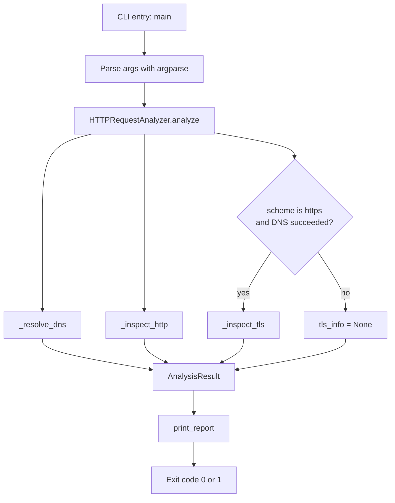

# HTTP Request Analyzer

## Overview

HTTP Request Analyzer is a command-line tool for inspecting a URL from three angles at once: DNS resolution, the HTTP request/response cycle, and the TLS/SSL certificate on the server (when the URL is HTTPS). Point it at a URL and it resolves the hostname, times and performs the HTTP request, and — if applicable — opens a TLS connection to pull certificate details, printing a single readable report to the terminal.

It's aimed at the kind of quick diagnostic check a developer or sysadmin runs when something's off with a site: is DNS resolving correctly, how long is the request taking, what headers is the server sending back, and is the certificate about to expire.

## Features

- **DNS resolution** — resolves a hostname to its IP addresses (IPv4/IPv6) and reports how long resolution took, in milliseconds.
- **HTTP inspection** — performs a GET request and reports status code, reason phrase, response time, content length, and the full set of response headers.
- **Redirect tracking** — records the chain of URLs followed if the request is redirected.
- **TLS/certificate inspection** — for HTTPS targets, opens a raw TLS connection to read the negotiated protocol version and cipher suite, plus the certificate's subject, issuer, validity window, and days remaining until expiry (with a warning flag when fewer than 30 days remain).
- **Configurable timeout** — request/connection timeout can be set via a CLI flag (default 8 seconds).
- **Insecure mode** — an `--insecure` flag to skip TLS certificate/hostname verification, useful for self-signed certificates in dev/test environments.
- **Formatted terminal report** — all three sections (DNS, HTTP, TLS) are printed in a structured, human-readable block.
- **Non-zero exit code on HTTP failure** — the process exits with status `1` if the HTTP request fails, making it usable in scripts/CI checks.

## Tech Stack

- **Language**: Python 3 (uses `from __future__ import annotations` and the `X | None` union syntax, so Python 3.10+ is expected)
- **HTTP client**: [`requests`](https://pypi.org/project/requests/)
- **Certificate parsing**: [`cryptography`](https://pypi.org/project/cryptography/) (`x509`, `hazmat.backends`)
- **Standard library**: `argparse` (CLI), `socket` (DNS + raw TCP), `ssl` (TLS handshake), `dataclasses`, `datetime`, `urllib.parse`, `time`, `sys`

No database, web framework, or external service is used — this is a self-contained script.

## Project Architecture

The project is a single script organized into clear sections rather than separate modules. There's no client/server split — it's a synchronous CLI tool that performs three sequential network checks against one target and prints the result.



The flow, concretely:

1. `main()` parses CLI arguments and constructs an `HTTPRequestAnalyzer`.
2. `analyze()` parses the URL, then calls the three internal inspection methods in order: DNS, HTTP, and (conditionally) TLS.
3. Each inspection method returns its own dataclass (`DNSInfo`, `HTTPInfo`, `TLSInfo`), catching and recording errors locally rather than raising, so one failed check doesn't stop the others from running.
4. The three results are combined into a single `AnalysisResult`.
5. `print_report()` takes that result and formats it into the terminal output.
6. `main()` returns a process exit code based on whether the HTTP check errored.

## Project Structure

This project currently consists of a single file — there's no multi-folder layout, package structure, tests, or configuration files in what was analyzed.

```text
.
└── main.py   # Entire application: data models, analyzer logic, report printing, and CLI entry point
```

Within `main.py`, the code is organized into four logical sections (marked by comments in the file):

- **Data Containers** — `DNSInfo`, `TLSInfo`, `HTTPInfo`, and `AnalysisResult` dataclasses that hold the results of each check.
- **Analyzer** — the `HTTPRequestAnalyzer` class, with `analyze()` as the public entry point and `_resolve_dns()`, `_inspect_http()`, `_inspect_tls()` as the three private check methods.
- **Report formatting** — `print_report()`, which renders an `AnalysisResult` as readable terminal output.
- **CLI** — `main()`, which wires up `argparse` and drives the whole process.

### A note on what's not here

Since only `main.py` was provided, this documentation doesn't include a dependency manifest (`requirements.txt`/`pyproject.toml`), README badges, tests, Docker files, or environment configuration — none of these exist in the uploaded project. If you add a `requirements.txt`, it would need at minimum:

```text
requests
cryptography
```

## Usage

```bash
python main.py https://example.com
python main.py example.com --timeout 5
python main.py https://self-signed.example --insecure
```

### CLI arguments

| Argument | Required | Default | Description |
|---|---|---|---|
| `url` | Yes | — | Target URL to analyze (scheme defaults to `https://` if omitted) |
| `--timeout` | No | `8.0` | Timeout in seconds for DNS/HTTP/TLS operations |
| `--insecure` | No | `False` | Skip TLS certificate and hostname verification |

### Exit codes

- `0` — HTTP check succeeded (DNS or TLS issues alone do not change the exit code)
- `1` — HTTP request failed